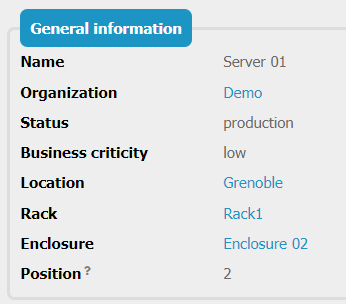
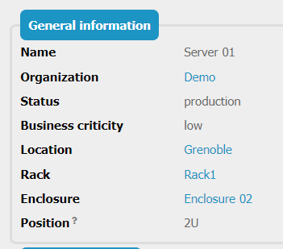
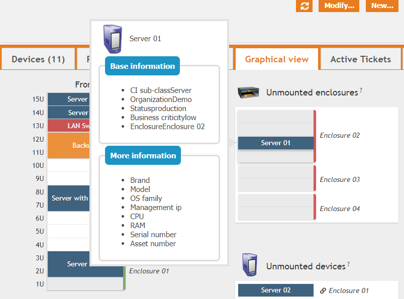
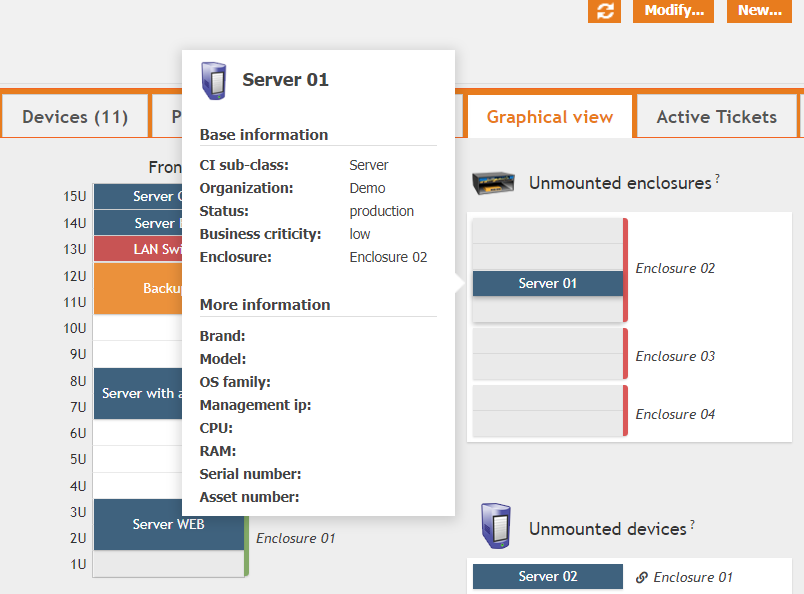
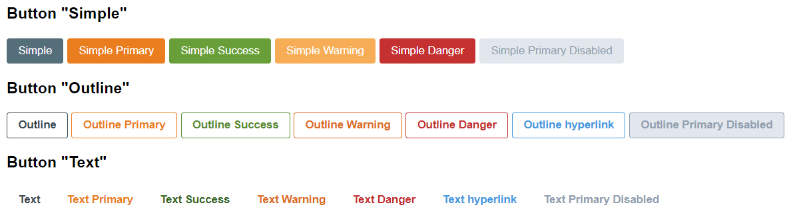

# iTop extension: molkobain-handy-framework
* [Description](#description)
* [Content](#content)
* [Compatibility](#compatibility)
* [Downloads](#downloads)
* [Installation](#installation)
* [Configuration](#configuration)

## Support
If you like this project, you can buy me beer, always appreciated! 🍻😁

## Description
A bunch of Core & UI helpers to be used by other extensions.

This extension doesn't bring any features, it is meant to used by some extensions out there or by you to create your own.

## Content
### Attribute types
* `AttributeRackUnit`: Extends the `AttributeInteger` type to show the 'U' unit on display.

*Example on a server with the `Position` attribute before and after using the new rack unit type*

 
 

### UI
#### Console tooltips
Use the new `molkobain-light` and `molkobain-dark` themes to qTip tooltips for a more modern look & feel.

*Tooltip with the regular `light` theme and with the new `molkobain-light`theme.*

#### Toggle buttons
Display checkboxes as nice toggle buttons in forms by using `UIHelper::MakeToggleButton()`.

#### Button designs
Some CSS clases to put predefined designs on buttons. Check the `.mhf-button` classes.

#### Loading overlay
Use the `.mhf-loader` class to have a nice overlay when you need to block some parts of the UI.
Toggle `.mhf-hide` class on it to hide / show it.

### Code helpers
#### String manipulations
`StringHelper` class to simplify some string manipulations:
* `StringHelper::ToCamelCase($sInput)` transforms a snake case string into a camel case string (eg. `"some_string" => "SomeString"`) 

## Compatibility
Compatible with iTop 2.7+

## Downloads
Stable releases can be found on the [releases page](https://github.com/Molkobain/itop-handy-framework/releases).

Downloading it directly from the *Clone or download* will get you the version under development which might be unstable.

## Installation
Installation procedure is the same as for any iTop extension, just follow the instruction on the iTop official documentation [here](https://www.itophub.io/wiki/page?id=extensions%3Ainstallation).

## Configuration
No configuration needed.

### Parameters
The extension has only 1 configuration parameter:
  * `enabled`: Enable or disable extension. Possible values are `true`|`false`, default is `true`.

## Licensing
This extension is under [AGPLv3](https://en.wikipedia.org/wiki/GNU_Affero_General_Public_License).
